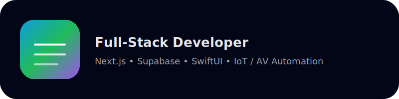

<!-- Banner -->

  

<h1 align="center">Hi, I'm Costa — Full-Stack Developer & Automation Engineer</h1>
<h3 align="center">Next.js • Supabase • SwiftUI • IoT/AV Automation • Multi-Business Founder</h3>

---

## 🚀 About Me

I'm a **full-stack developer** building modern, scalable applications with **Next.js, Supabase, SwiftUI, n8n, and cloud-native tooling** — specialising in **real-time systems, multi-tenant security, workflow automation, and IoT/AV integrations**.

Alongside software development, I'm a **multi-business founder** leading:

- 🔹 **Connected Spaces** — A SaaS CRM & operations platform for home-automation companies  
- 🔹 **Modal AV** — A high-end AV consultancy & smart-home systems designer  
- 🔹 **Dropup Studio** — A development studio creating apps, digital experiences, and automation solutions  

I bring together **software engineering**, **automation**, and **physical systems** to build elegant, powerful tools that solve real-world problems.

---

## 🧰 Tech Stack

### **Frontend**

### **Backend / DevOps**

### **Mobile Development**

### **IoT / Hardware**

---

## 🔭 Current Projects

### 🔹 **Connected Spaces**  
A full SaaS platform for the home-automation industry:  
multi-tenant CRM, projects, inventory, maintenance workflows, RLS-based security, encrypted vault, and automation engine.

### 🔹 **Modal AV**  
A system-builder for high-end smart homes:  
cinema design, lighting control, networking, commissioning tools, and AV-driven automation workflows.

### 🔹 **Dropup Studio**  
A design & development studio delivering apps, websites, and automation solutions for brands, creators, and businesses.

---

## 📊 GitHub Stats & Activity

  
  

  

---

## 🌐 Connect With My Work

- 🔗 **Modal AV** — https://modalav.co.uk  
- 🔗 **Dropup Studio** — https://dropup.studio  
- 🔗 **Connected Spaces** — *coming soon*  

---

### ⚡ Philosophy  
I build systems that merge **software, automation, and real-world experiences** — creating seamless, powerful, long-lasting solutions.

Always open to meaningful collaborations.  
**Let’s build something brilliant. 🚀**
